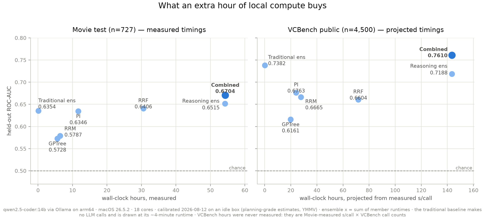

# VCBench + Movie with a local LLM (qwen2.5-coder:14b via Ollama)

Run all four TRL reasoning-ML methods (PolicyInduction, RRF, GPTree, RRM) on two
real benchmarks with a **free, local** LLM — no paid API keys — then compare them
to a 5-model sklearn baseline and combine both families into an ensemble.

## What you'll build

1. Four reasoning-ML models scored on **VCBench** (founder-success prediction,
   our anchor dataset) and **Movie** (award-nomination prediction, temporal
   split).
2. A traditional-ML baseline: LR, HistGradientBoosting, RandomForest-250,
   ExtraTrees-250, GaussianNB over `[text-length, MiniLM-L6-v2 embeddings,
   TF-IDF top-400]` features.
3. A combined ensemble: `rank01(traditional_ensemble) + rank01(reasoning_ensemble)`.
4. A time-vs-score chart showing what each extra hour of local compute buys you.

The honest headline, up front: **neither family wins on its own.** Traditional
ML beats the reasoning methods on VCBench; on Movie the reasoning ensemble edges
ahead by +0.016 ROC-AUC — on n=727, inside sampling noise, so call it
*competitive*, not a win. What holds on **both** datasets is that the combined
ensemble beats both families — the two make different mistakes, and that
diversity is worth more than either family's margin over the other.

## The hero chart



Regenerate it with `python scripts/make_hero_figure.py` — it reads only
`precomputed/` (no LLM, no network) and is deterministic. The Movie panel's
hours are **measured** (calibrated 2026-08-12 on an idle Apple-silicon Mac); the
VCBench panel's are **projected** from the Movie-measured seconds-per-call ×
each runner's VCBench call count, because VCBench was never timed.

The coloured lines are the **interpretable** traditional models — logistic
regression, Gaussian NB, a depth-5 decision tree, k-NN. They make no LLM calls
and finish in minutes, so they have no meaningful position on an hours axis.
That's the fair fight for this library: every TRL method produces an artifact a
person can read (policies, question shortlists, an LLM-guided tree, mined
rules), so the comparison that matters is against traditional models that are
also inspectable — and on both datasets the reasoning ensemble clears every one
of them (0.6515 vs k-NN's 0.6369 on Movie, 0.7188 vs 0.6972 on VCBench), with
the combined ensemble clearing everything on the chart. The depth-5 decision
tree is its own lesson: 0.4888 on Movie — below chance — because 785 embedding
features are unsplittable without help, while GPTree, the same structure with
an LLM choosing the questions, doesn't collapse.

Two honest footnotes, both printed on the figure. The black-box tree ensembles
score higher than anything interpretable (random forest 0.6409 on Movie,
extra-trees 0.7321 on VCBench) — beating an uninspectable model is a different
comparison, and `figures/time_vs_score_all_traditional.png` shows the full
5-model suite for the reader who wants it. And on Movie the best single
reasoning methods only tie k-NN — RRF spends 30,632 calls to land at 0.6406 vs
free k-NN's 0.6369 — so it's the ensemble, not any one method, that clears the
interpretable field.

The traditional lines come from
`precomputed/*_traditional_permodel_scores.csv`: a per-model refit by
`scripts/make_permodel_scores.py` under the pinned scikit-learn 1.9.0, using
`run_traditional.py`'s exact features, splits and seed. Its 5-model
rank-average lands at 0.6365 Movie / 0.7437 VCBench versus the shipped ensemble
CSV's 0.6354 / 0.7382 — ordinary library/BLAS drift. The results table below
quotes the shipped ensemble; the figure recomputes and asserts both files at
4 decimal places.

## Results

ROC-AUC / PR-AUC. VCBench public: n=4,500, base rate 9.0%. Movie test: n=727,
base rate 20.8%.

| Method | VCBench public | VCBench private* | Movie test |
|---|---:|---:|---:|
| PolicyInduction | 0.6763 / 0.1831 | 0.6556 / 0.1740 | 0.6346 / 0.2761 |
| RRF | 0.6604 / 0.1689 | 0.6681 / 0.2262 | 0.6406 / 0.3048 |
| GPTree | 0.6161 / 0.1320 | 0.5268 / 0.1053 | 0.5728 / 0.2447 |
| RRM | 0.6665 / 0.1725 | 0.6662 / 0.1638 | 0.5787 / 0.2465 |
| Reasoning ensemble (rank-avg of 4) | 0.7188 / 0.2072 | 0.6850 / 0.2129 | 0.6515 / 0.3007 |
| Traditional ensemble (rank-avg of 5) | 0.7382 / 0.2258 | 0.7420 / 0.2570* | 0.6354 / 0.2927 |
| **Combined** | **0.7610 / 0.2546** | — | **0.6704 / 0.3166** |

Every VCBench-public and Movie number is recomputed by the notebooks from the
CSVs in `precomputed/` and asserted at 4 decimal places — what you reproduce is
exactly this table, not a paraphrase of it.

- **\*The VCBench private column is a maintainer reference.** The private
  split's labels (and its traditional scores) are deliberately not shipped, so
  nothing in this column can be recomputed from this repo. It is shown as the
  held-out target the public numbers generalize to. No private combined number
  exists — computing one needs the private prose, which is not on disk here.
- **The private split hands the ensemble its one loss:** on private PR-AUC, RRF
  alone (0.2262) beats the reasoning ensemble (0.2129). Rank-averaging a strong
  member with three weaker ones can cost you precision at the top of the
  ranking even while it buys ROC — worth internalizing before you ensemble
  everything by reflex.
- **Traditional per-model scores are run-dependent** (tree ensembles are not
  bit-stable across sklearn versions or hardware; the ensemble drifts ~±0.005,
  single models more). The ensemble rows above are the stable, asserted ones;
  notebook 03 prints the per-model board live if you want a best-single —
  expect its identity to move between runs.
- Scores here are colleague-grade, not paper-grade: this example teaches the
  methods; it is not a benchmarking paper. The VCBench paper's dedicated
  hand-crafted-feature baselines score higher than this panel-style suite.

## Start here: the notebooks

| Notebook | Needs | What it does |
|---|---|---|
| `01_quickstart.ipynb` | **nothing** — no dataset, no network, no Ollama | The whole example in ~5 min from `precomputed/` |
| `02_reasoning_methods.ipynb` | nothing (one optional live cell uses Ollama) | What each method's learned artifact *is* — policies, questions, tree, rules — and each one's score |
| `03_traditional_baselines.ipynb` | nothing (one optional live cell fetches Movie) | The 5-model suite, and reasoning-vs-traditional on both datasets |
| `04_ensembling.ipynb` | nothing | Rank-averaging, the combined ensemble, and the full table above |

## Prerequisites

- **Ollama** installed and running (`https://ollama.com`).
- The pinned model pulled: `ollama pull qwen2.5-coder:14b`
  (Q4_K_M quantization; captured 2026-08-07 — later re-pulls may differ slightly).
- Python 3.13 with the library + example extras:

  ```bash
  pip install -e ".[examples]"
  ```

  The extra pins `scikit-learn==1.9.0` — the version the shipped traditional
  scores were computed under. On other versions the traditional ensemble drifts
  ~±0.005 (same class of nondeterminism as the local LLM itself); the notebook
  assertions read the shipped CSVs, so they pass either way.

Only the notebooks' optional live cells and the `scripts/run_*.py` full runs
need Ollama; everything else works offline.

## Getting the datasets

Raw data is **not** committed to this repo; fetch it yourself:

- **VCBench** — not publicly downloadable. Request it at
  [vcbench.com](https://vcbench.com) ("Request data" in the sidebar); access is
  granted on request. Ask for the public split: 4,500 founders, ~9% base rate,
  columns `founder_uuid`, `success`, `anonymised_prose`. Save the CSV wherever
  you like and point the example at it:

  ```bash
  export VCBENCH_DATA=~/.trl-data/vcbench/vcbench_final_public.csv
  ```

- **Movie** — public HuggingFace dataset
  ([`Francis2003/Movie-O-Label`](https://huggingface.co/datasets/Francis2003/Movie-O-Label)),
  fetched automatically by the scripts and notebook 03's live cell. Temporal
  split: train = films before 2013 (n=1,461, base rate 18.0%), test = 2013
  onward (n=727, base rate 20.8%), after dropping 12 duplicate ids.

In every shipped CSV the join column is **`id`** — it holds the founder UUID on
VCBench and the IMDb tconst on Movie.

## Runtime expectations (read before running anything)

From `precomputed/timings.json`, measured 2026-08-12 on an idle Apple-silicon
Mac (arm64, 18 cores) with Ollama serving `qwen2.5-coder:14b` — planning-grade
estimates from a small calibration slice, not benchmarks. YMMV:

| Method | s/call (measured) | LLM calls, full Movie run | Projected full Movie run |
|---|---:|---:|---:|
| GPTree | 2.65 | 7,654 | **~5.6 h** |
| RRM | 2.77 | 8,295 | **~6.4 h** |
| PolicyInduction | 1.91 | 22,026 | **~11.7 h** |
| RRF | 3.59 | 30,632 | **~30.5 h** |
| Traditional (no LLM) | — | 0 | **~4 min** |

The call counts are arithmetic from each runner's defaults and are
machine-independent; the hours are `s_per_call × calls`. A full VCBench public
run was never timed — projecting the same rates over its call counts gives
roughly GPTree 20 h · PI 24 h · RRM 28 h · RRF 72 h (fit and score all 4,500
rows; treat these as order-of-magnitude). Two things the playground
verification runs (2026-08-25) taught us about those projections:

- **GPTree's rate held up**: fitting and scoring n=1,500 took 6.4–6.7 h,
  within a few percent of what the projection implies.
- **RRM's blended s/call hides a slow phase.** Its Stage 1 generates one long
  reasoning log per *fit* row and measured **~23 s/call** — nearly 10× the
  blended rate — so mining cost is linear in fit size, and at the old
  fit-on-everything default, Stage 1 alone on 4,500 rows would be ~29 h. The
  VCBench runner now defaults to a stratified fit of 350 (like Movie's 346);
  the shipped reference bundle predates the cap and used the full split
  (`--fit-size 0` reproduces it, at that cost). The runners' mid-run ETA
  extrapolates one blended rate, so during RRM's Stage 1 it over-estimates
  wildly and then falls fast — don't kill a run because of it.

- Start with notebook 01; it needs none of this.
- Every long run is restart-safe: per-call responses are cached to a JSONL on
  disk, so a killed run resumes where it left off. (RRM's fit samples at
  temperature 1.0 and opts into caching those calls — see
  `src/disk_cache.py` for why that is not the default.)
- `scripts/calibrate_timings.py --dataset movie` measures throughput on *your*
  machine and rewrites `precomputed/timings.json`; every runner's start-up
  banner then quotes your own numbers. Its default slice is n=100 per method
  (the committed file was measured at n=100 for PI/RRF/GPTree and n=10 for RRM,
  merged — the file-level `n_calibration` field records the last run's slice).

## The playground: VCBench at 1/3 the size

Full VCBench runs cost tens of hours, so the example ships a **playground**: a
fixed 1,500-founder subsample of the public split (135 positives — the same 9%
base rate), chosen so the findings you'd care about reproduce on it. Build it
from your VCBench download and point any runner at it:

```bash
python scripts/make_playground.py --data "$VCBENCH_DATA"
python scripts/run_gptree.py --dataset vcbench --data results/playground_records.csv
```

A full four-method playground run projects to ~15–20 h instead of ~70+ (GPTree
measured 6.4–6.7 h; RRM ~2.7 h at its fit-350 default; PI/RRF projected ~5 h /
~16 h). The traditional baseline is under a minute.

**How the size was chosen.** `scripts/playground_sizing_analysis.py`
(seeded, reads only `precomputed/`) subsamples the public 4,500 two thousand
times per candidate size and measures how often each full-set conclusion
reproduces. At n=1,500 the combined-ensemble thesis reproduces in ~98% of
random draws and the four core conclusions jointly in ~69%; pushing the joint
figure to 90% would need n≈2,400, most of the dataset. The shipped sample is a
label-stratified, embedding-cluster-balanced draw — selected without looking
at any method's scores, then validated — whose refit behaviour sits at the
median of eleven such candidates.

**What to expect when you run it** — `playground/reference.json` holds the
maintainer reference, recomputed and asserted by
`scripts/playground_reference.py`:

| Series (ROC-AUC) | full 4,500 | playground, refit |
|---|---:|---:|
| Reasoning ensemble | 0.7188 | 0.7075 |
| Traditional ensemble | 0.7437 | 0.7050 |
| **Combined** | **0.7632** | **0.7409** |

Refit numbers are *systematically lower* than the full-benchmark reference:
models fit on 1,500 rows learn less. The verification runs measured −0.02 to
−0.06 ROC-AUC per refit model, and traditional models pay more of that price
than the reasoning methods (PI and RRF fit on fixed tiny samples — 10-row
context batches, 40 labelled examples — so shrinking the dataset barely
touches them).

**What carries over, verified end-to-end** (GPTree and RRM actually refit on
the playground, twice, on two independently drawn samples): the combined
ensemble beats both families on ROC *and* PR-AUC; the reasoning ensemble beats
every interpretable traditional model; GPTree is the weakest single method.
**What deliberately does not**: the full-benchmark result that the traditional
ensemble edges the reasoning ensemble — on the playground the two families
tie (refitting hurts the label-only learners more), so treat any
family-vs-family margin you see here as noise; exact method rankings (PI vs
RRM vs RRF are within ~0.01 of each other); and PR-AUC margins generally, with
only ~135 positives. If your new method beats the combined ensemble here by
less than ~0.03 ROC-AUC, confirm on the full split before believing it.

Two mechanical notes: GPTree leaves some rows unscored (91 of 1,500 in the
reference run — rows its tree cannot route to a leaf); the reference
median-imputes them before ensembling. And the playground refit reference for
GPTree/RRM ships in `playground/*_refit_scores.csv`, so you can compare your
own refit run founder-by-founder, not just by headline number.

## Running the methods yourself

```bash
# one method, one dataset
python scripts/run_pi.py --dataset movie

# everything, sequentially, with preflight checks and caffeinate
bash scripts/run_all.sh --dataset movie
```

Things to know before you burn a day of compute:

- **A from-scratch run lands *near* the shipped numbers, not on them.** The
  scripts refit against a local, sampling LLM; expect scores within a few
  hundredths, further if you change `--fit-size` or regenerate questions. The
  shipped `precomputed/` CSVs are the reference.
- **`--smoke` first.** Every runner has a `--smoke` mode (couple of minutes,
  own cache) that exercises the full pipeline on a dozen rows.
- **PI needs positives in its fit set.** Policy induction samples balanced
  10-row context batches, so it needs at least ~5 positive examples — on
  VCBench's 9% base rate that means `--fit-size` below ~56 cannot induce
  anything (the runner shrinks the batch and warns). GPTree has the analogous
  degeneracy and refuses to score a one-node tree.
- The runners write to `results/` (gitignored), never to `precomputed/`, and
  refuse to start if `OPENAI_BASE_URL` points anywhere non-local — a
  30,000-call run pointed at a paid API by accident is an expensive typo.

## Directory tour

| Path | What it is |
|---|---|
| `notebooks/01_quickstart.ipynb` … `04_ensembling.ipynb` | The guided tour — see table above |
| `scripts/run_{pi,rrf,gptree,rrm}.py` | Full local runs, one per method |
| `scripts/run_traditional.py` | The 5-model sklearn baseline (no LLM) |
| `scripts/_runner_common.py` | Shared runner plumbing: dataset loading, splits, the answer-vector→score combiner, call estimates |
| `scripts/run_all.sh` | Everything, sequentially, with preflight checks |
| `scripts/calibrate_timings.py` | Throughput calibration on your machine → `precomputed/timings.json` |
| `scripts/make_hero_figure.py` | Regenerates both charts in `figures/` from `precomputed/` |
| `scripts/make_permodel_scores.py` | Regenerates the per-model traditional CSVs the charts' lines come from (needs the raw datasets) |
| `scripts/make_playground.py` | Slices your VCBench download to the fixed 1,500-founder playground |
| `scripts/playground_reference.py` | Recomputes + asserts `playground/reference.json` from committed CSVs |
| `scripts/playground_sizing_analysis.py` | The seeded Monte Carlo behind the playground's size |
| `scripts/run_movie_*.sh`, `kickoff_movie_all.sh`, `check_movie_progress.sh` | Maintainer scripts that produced the shipped Movie artifacts (reference machine only) |
| `src/llm.py` | The LLM factory every runner and notebook goes through — `get_local_llm()` |
| `src/disk_cache.py` | Restart-safe per-call JSONL cache, temperature-aware |
| `src/logprobs_llm_shim.py` | Pre-PR-#81 adapter: chat-completions + logprobs against Ollama |
| `precomputed/` | Reference score CSVs (the results table + the per-model traditional refit) + `timings.json` |
| `playground/` | The 1,500-founder playground: id list, refit reference scores, `reference.json` |
| `models/` | The trained, PII-vetted model bundles the notebooks open |
| `figures/` | The two charts, regenerable from `scripts/make_hero_figure.py` |

Two deliberate asymmetries in `models/`, so they don't read as oversights:
VCBench's RRM bundle ships with its raw rules emptied (they can quote training
prose; predict uses only the compiled policy + calibrator), while Movie's keeps
all 346 rules — they are mined aggregates over public plot summaries and the
most legible teaching artifact in the example. And held-out splits
(`vcbench_private_*`, `movie_test_*`) ship scores without labels; Movie test
labels come from `movie_test_traditional_scores.csv` and its `_permodel_`
sibling, the only shipped files that carry them.

## Why the shim?

TRL's stock OpenAI provider targets the `/v1/responses` endpoint, which
Ollama's OpenAI-compat layer doesn't serve, and it doesn't return token
logprobs (RRM needs them). `src/logprobs_llm_shim.py` is a small drop-in `LLM`
replacement using `chat.completions` with `logprobs=True`.

You never construct it directly: every runner and notebook builds its LLM
through **`src/llm.py`'s `get_local_llm()`**, which prefers the library's
`OpenAILLM` when it can talk to Ollama and falls back to the shim, then wraps
either in the disk cache. Library PR
[#81](https://github.com/Vela-Research/think-reason-learn/pull/81) adds
chat-completions + logprobs support to `OpenAILLM` itself; once it merges, the
shim and the fallback branch get deleted and the factory keeps working
unchanged. The example works either way. Ollama's default endpoint is assumed;
override with:

```bash
export OPENAI_BASE_URL=http://localhost:11434/v1   # the default
```

## Reading the score files

- Reasoning scores are **rankings, not calibrated probabilities**. In
  particular RRM's Movie scores are the raw fused-combiner output and land
  around **−10.9 to −10.6** — that is what ships and what a rerun produces;
  only the ordering is used. (VCBench RRM's happen to land in 0.08–0.32.)
- PI and RRF ship one score per row, produced by collapsing their per-policy /
  per-question answer vectors with an out-of-fold logistic combiner
  (`_runner_common.py` has the exact operator).
- `*_traditional_scores.csv` carries the 5-model rank-average ensemble (the
  results table); `*_traditional_permodel_scores.csv` carries one probability
  column per traditional model — the suite's five plus the decision tree and
  k-NN the hero chart draws — from `scripts/make_permodel_scores.py`'s refit
  (see the hero-chart section for the small ensemble drift between the two).

## Cloud reference (optional)

The same VCBench bundles run against a cloud LLM (Gemini 2.5 Flash, calibrated,
private split) score: PI 0.669/0.204 · RRF 0.726/0.254 · GPTree 0.587/0.164 ·
RRM 0.602/0.137 · reasoning ensemble 0.700/0.218. Faster wall-clock, per-token
cost, API keys required — reference only; nothing in this example needs a cloud
key, and the cloud and local runs are not directly comparable (different
models, prompts frozen at different times).

## Model pinning

`qwen2.5-coder:14b` (Ollama tag, Q4_K_M quantization, captured 2026-08-07).
We pin tag + quantization + capture date rather than a digest — good enough
for a teaching example; expect small score drift if the tag is re-published.
